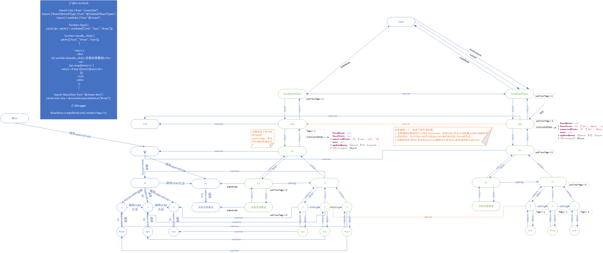

# React 皇舆版图

## 源码

```javascript
// @ts-nocheck

import { jsx } from './react/jsx'
import { ReactElementType } from '@/shared/ReactTypes';
// const App = jsx("div", {
//     children: jsx("span", {
//       id: "xxx",
//       children: "ssss"
//     })
// })
import { useState, useEffect } from '@/react';

function effect1() {
	console.log('useEffect回调111执行')

	return () => {
		console.log('effect1111 销毁')
	}
}

function effect2() {
	console.log('useEffect回调2222执行')

	return () => {
		console.log('effect222 销毁')
	}
}

function Bpp() {}

function App() {
	const [count, setCount] = useState(0)
	const [count2, setCount2] = useState(2)
	// 已经在递阶段，修改App的fiber对象
	// a=>a
	// effect的hooks也是环状链表 a=>b => =a
	useEffect(effect1)

	useEffect(effect2)

	function handle_click() {
		setCount(count + 1)
	}
	// a => a
	return (
		<div >
			<h1 onClick={handle_click}>点我新增22 {count}</h1>
			
			<Bpp />
			{/* <h2>{count}</h2> */}
		</div>
	);	
}


import ReactDom from '@/react-dom'
const root: any = document.querySelector('#root')

// debugger

ReactDom.createRoot(root).render(<App />)

```

## 对应的图示

这个图示确实理解起来挺费劲的，需要跟着[视频](https://www.bilibili.com/video/BV198mKYYEKN)才能看懂

### 界面首次加载

<figure><figcaption></figcaption></figure>

### 界面刷新

<figure><figcaption></figcaption></figure>
