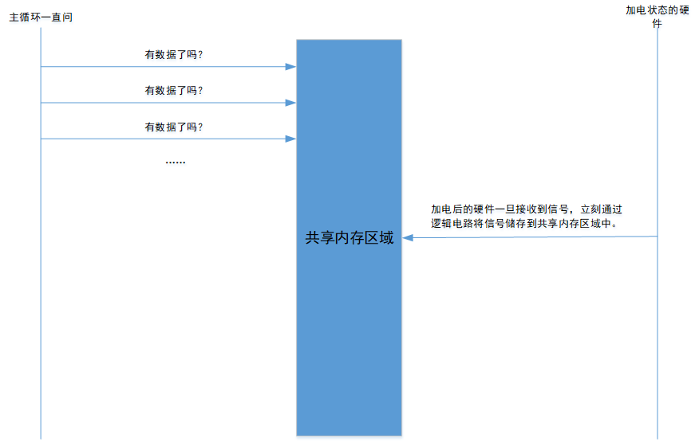

# 🐶 select\&poll\&epoll

## 关于IO复用

### 传统I/O模型

<figure><figcaption><p>传统IO模型</p></figcaption></figure>

### 传统I/O模型弊端

**一个连接一个线程：** 在传统的 I/O 模型中，每个客户端连接都需要一个独立的线程（或进程）来处理。当并发连接数很大时，会创建大量的线程，导致系统资源占用过多，上下文切换频繁，效率低下。

### 什么是IO复用？

**进程需要被内核告知的能力，使得内核一旦发现进程指定的一个或多个IO条件就绪，它就通知进程。**

### I/O复用模型

<figure><figcaption><p>IO复用模型</p></figcaption></figure>

### IO复用及其优势

* **一个线程处理多个连接：** I/O 复用技术允许一个线程（或进程）同时监控多个 I/O 流。当其中任何一个 I/O 流有事件发生时（例如有数据可读、有数据可写），线程会被通知，然后可以对相应的 I/O 流进行处理。
* **减少资源占用：** 由于只需要一个线程来处理多个连接，I/O 复用可以大大减少线程（或进程）的数量，从而降低系统资源的占用。
* **提高效率：** 减少了线程（或进程）的创建和销毁，以及上下文切换的开销，从而提高了系统的运行效率。

### I/O 复用通常通过以下几种方式实现

* **select:** 允许同时监控多个文件描述符，当其中任何一个文件描述符就绪时，`select` 会返回。
* **poll:** 与 `select` 类似，但没有最大文件描述符数量的限制。
* **epoll:** 一种更高效的 I/O 多路复用机制，在 Linux 系统上广泛使用。

## select

select 允许进程指示内核等待多个事件中的任何一个发生，并只在有一个或多个事件发生或经历一段指定的时间后才唤醒它。

也就是说，我们调用select告知内核对哪些描述符有兴趣以及等到多长时间。我们感兴趣的描述符不局限于套接字，任何描述符都可以使用select来测试。

```c
#include <sys/select.h>
#include <sys/time.h>

int select(int maxfdp1, fd_set *readset, fd_set *write_set, fd_set *exceptset, const struct timeval *timeout);
```

**maxfdp1：**指定待测试的描述符的个数，它的值是待测试的最大描述符加1，因此被命名为maxfdp1。比如我们对描述符1、4、5感兴趣，那么maxfdp1就是6。是6不是5的原因在于：描述符是从0开始的。

**fd\_set（描述符集）：**readset、writeset、exceptset帮助我们指定让内核监听读、写和异常的描述符。目前支持的异常条件有两个：

1. 某个套接字的带外数据到达。带外数据指的是一个连接的某端发生了重要的事情，而且希望迅速通告其对端。这里“迅速”意味着这种通知应该在已经排队等待发送的任何“普通”数据之前发送。也就是说：带外数据被认为比普通数据具有更高的优先级。
2. 某个已置为分组模式的伪终端存在可从其主端读取的控制状态信息。
   * **伪终端（pseudo-terminal）**： 是一种软件模拟的终端设备，通常由一对主从设备组成。主设备用于控制终端的行为，从设备用于模拟实际的终端。
   * **分组模式（packet mode）**： 是一种伪终端的特殊操作模式，在这种模式下，终端输入和输出的数据以数据包（packet）的形式进行传输，而不是逐个字符传输。
   * **主设备（master side）**： 伪终端的主设备，用于控制终端的行为，例如设置终端属性、发送信号等。
   * **控制状态信息**： 指的是关于伪终端当前状态的信息，例如终端大小、波特率、输入模式等。

由以下四个宏负责操作描述符集：

```c
void FD_ZERO(fd_set *fdset);  /* clear all bite in fdset */
void FD_SET(int fd, fd_set *fdset);  /* turn on the bit for fd in fdset */
void FD_CLR(int fd, fd_set *fdset);  /* turn off the bit for fd in fdest */
int FD_ISSET(int fd, fd_set *fdset);  /* is the bit for fd on in fdset? */
```

举个例子，我们用下面的代码顶一个一个fd\_set类型变量，然后打开描述符1、4、5的对应位：

```c
fd_set rset;
FD_ZERO(&rset);  /* 初始化rset，将rset中是所有的位置置为0 */
FD_SET(1, &rset);  /* 在rset中打开描述符1，rset中可以记录1024（一般是1024）个描述符，rset在1对应的位置置为1 */
FD_SET(4, &rset);
FD_SET(5, &rset);
```

select中间的三个参数，如果我们对某个条件不感兴趣，可以将其置为空指针。

**timeout：**告知内核等待所指定描述符中的任何一个描述符就绪的最长时间。其中timeval结构用于指定这段时间的秒数和微秒数。

```c
struct timeval{
    long tv_sec;  /* seconds */
    long tv_usec;  /* microseconds */
}
```

这个参数有三个可能：

1. 永远等待下去：仅在有一个描述符准备好I/O以后才返回。此时该参数对应空指针。
2. 等待一个固定的时间：在有一个描述符准备好I/O时才返回，但是不超过由该参数所指向的time\_val结构中指定的秒数和微秒数。
3. 根本不等待：检查描述符后立即返回，这称为轮询（轮询所有描述符）。该参数指向一个time\_val结构，值为0。

> 如果中间的三个参数对应的指针都是空，我们会得到一个比unix的sleep函数更为精确的定时器（sleep是以秒为单位）。

### select最大描述符数

最初设计select的时候，操作系统通常对每个进程可用的最大描述符的上线进行了设置，但是当今的unix版本允许每个进程使用事实上无限数目的描述符。

下面的代码取自\<sys/types.h>

```c
#ifndef FD_SETSIZE
#define FD_SETSIZE    256
#endif
```

为了解决描述符数量上限问题，我们很容易想到将FD\_SETSIZE定义为某个更大的值，但是这样事实上是行不通的。主要是从可移植性的角度考虑这个问题。


## poll

## epoll


## 描述符就绪条件

我们一直在讨论等待某个描述符准备好I/O或是等待其上发生一个待处理的异常条件。尽管可读性和可写性对于普通文件这样的描述符显而易见，然而对于引起套接字“就绪”的条件我们必须再详细讨论下：

### 读就绪

1. 该套接字接收缓冲区中的数据字节数大于等于套接字接收缓冲区低水位标记的大小。对这样的套接字执行读的操作不会阻塞并将返回一个大于0的值（也就是返回准备好读入的数据）。我们可以使用SO\_RCVLOWAT套接字选项设置改套接字低水位标记。
2. 该连接的读半部关闭（也就是接收了FIN的连接）。对这样的套接字的读操作将不阻塞并返回0（也就是EOF）。
3. 该套接字是一个监听套接字且已完成的连接数大于0。对这样的套接字的accept通常不会阻塞。
4. 其上有一个套接字错误待处理，对这样的套接字的读操作将不阻塞并返回-1（也就是返回-1），同时把errno设置为确切的错误条件。

### 写就绪

1. 该套接字的发送缓冲区的可用空间字节数大于等于套接字发送缓冲区低水位标记的当前大小，并且或者该套接字已连接，或者该套接字不需要连接（如UDP套接字）。这意味着如果我们把这样的套接字设置为非阻塞，写操作将不阻塞并返回一个正值（例如由传输层接受的字节数）。我们可以使用SO\_SNDLOWAT套接字选项来设置该套接字的低水位标记。对于TCP和UDP套接字而言，其默认值是2048。
2. 该连接的写半部关闭。对这样的套接字的写操作将产生SIGPIPE信号。
3. 使用非阻塞connect的套接字已建立连接，或者connect以失败而告终。
4. 其上有一个套接字错误待处理。对这样的套接字的写操作将不阻塞并返回-1，同时把errno设置为确切的错误条件。

### 带外标记

如果一个套接字存在带外数据（带外数据指的是一个连接的某端发生了重要的事情，而且希望迅速通告其对端。这里“迅速”意味着这种通知应该在已经排队等待发送的任何“普通”数据之前发送。也就是说：带外数据被认为比普通数据具有更高的优先级），那么它有异常待处理。

## 软件怎么实现的监测数据的到来

### 中心思想

无论是select poll epoll，都避免不了在程序层面通过主（死）循环监测数据，但是使用这些手段可以减少CPU资源的浪费。

**为什么服务器程序需要循环：**

* **持续运行：** 服务器程序通常需要长时间运行，以提供持续的服务。循环可以保证程序不会在处理完一个请求后就退出。
* **事件驱动：** 即使在异步IO模型中，服务器程序也需要一个循环来驱动事件的处理。事件循环不断地从事件队列中获取事件，并调用相应的回调函数来处理事件。

服务器程序通常需要一个主循环来驱动程序的运行，这个循环可以是事件循环、定时器循环或者信号处理循环。虽然循环会占用一定的CPU资源，但通过使用异步IO、多路复用、硬件加速等技术，可以大大减少CPU的消耗，提高服务器程序的性能和可伸缩性。

## 硬件是怎么实现的监测数据的到来

硬件电路可以通过时钟信号、状态机等机制来实现连续的信号检测，而不需要显式的循环。这是因为硬件电路是并行执行的，可以在一个时钟周期内完成多个操作。

> 其实在硬件层面，可以把接收器加电的状态类比为for循环，加电的状态是持续的，逻辑电路可以类比为for循环内部的处理逻辑。

## 关于使用主循环的一些弊端

* **效率低下：** 如果使用 for 循环来等待信号，处理器会一直处于忙等待状态，浪费大量的 CPU 资源。
* **实时性差：** for 循环内部的某段程序执行时间是不确定的，可能会导致信号接收的延迟，影响系统的实时性。

但是应用服务器离不开主（死）循环。

## 猜测：IO模型中，一定有...

<figure><figcaption></figcaption></figure>

所以能够提升效率的地方在哪儿呢？

1、硬件层面：逻辑电路应该把接收到的数据放在一个应用进程（我们自己编写的服务器）触手可及的地方。也就是内核和用户共享的内存区。放在这里可以使应用进程在获取数据的时候不用进行用户-内核态的转换。

2、软件层面：在没有数据处理的时候，尽量少占CPU资源，进程投入睡眠。

