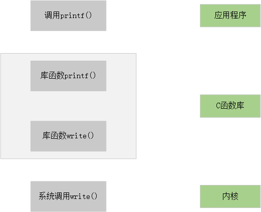

# 系统调用

系统调用是linux内核y与上层应用程序进行交互通信的唯一接口。

从对中断机制的说明可知，用户程序通过直接或间接调用中断 int 0x80 ，并在eax寄存器中指定系统调用功能号，即可使用内核资源，包括系统硬件资源。不过通常应用程序都是使用具有标准接口定义的C函数库中的函数间接地使用内核的系统调用。如下图所示：

<figure><figcaption></figcaption></figure>

通常系统调用使用函数的形式进行。系统调用的结果使用返回值表现出来，负值表示错误，0表示成功。在出错的情况下错误的类型码被存放在全局变量errno中。通过调用库函数perror()，
